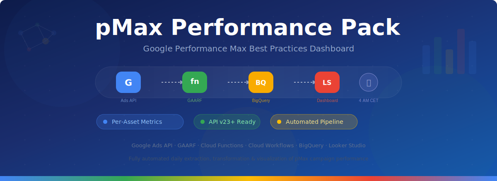
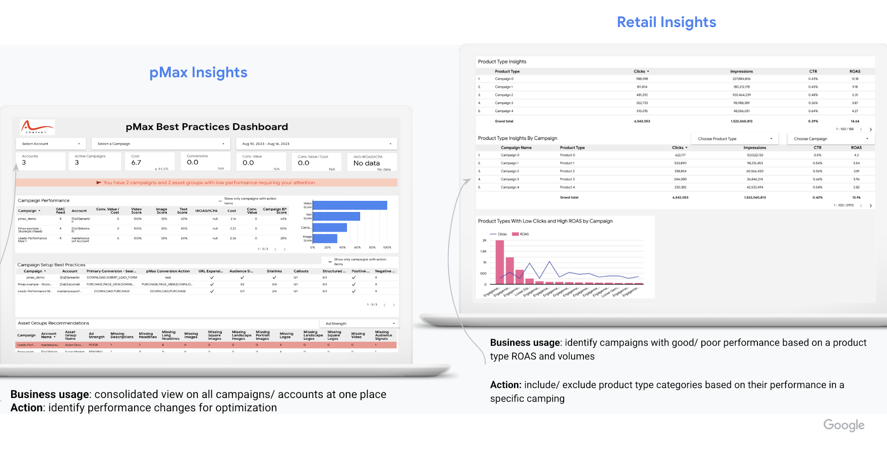
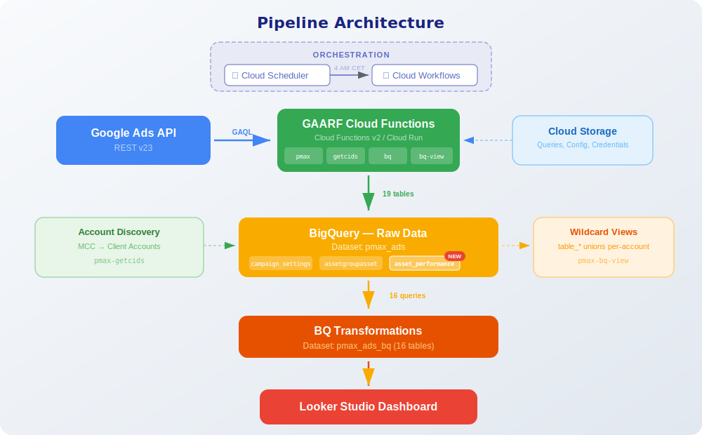
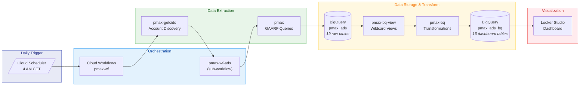
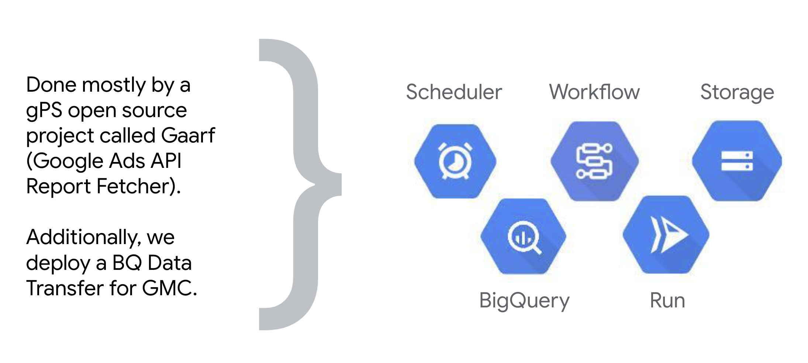
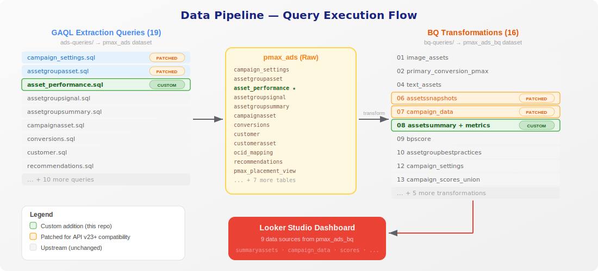
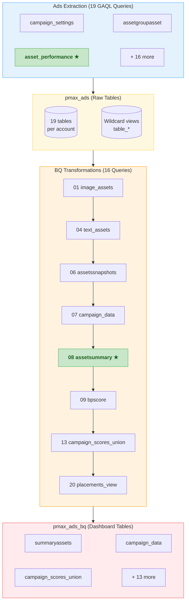
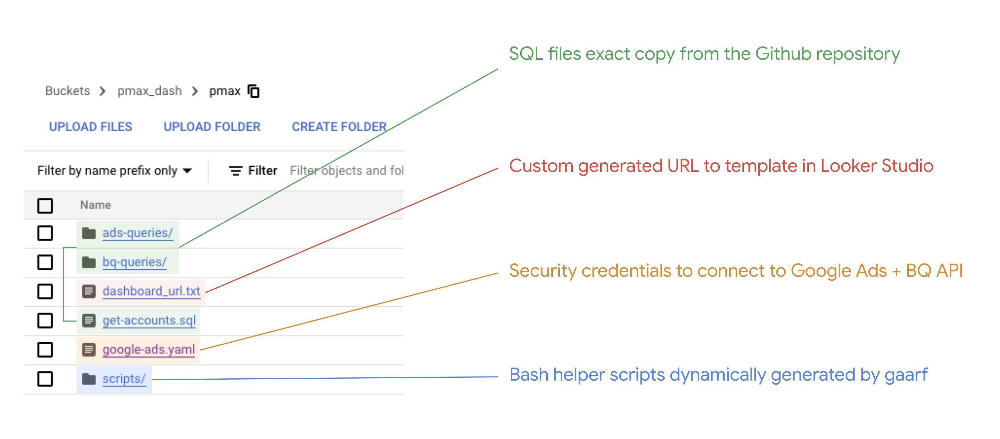

<p align="center">
  
</p>

<p align="center">
  <strong>A customized deployment of Google's <a href="https://github.com/google/pmax_best_practices_dashboard">pMaximizer</a> with per-asset performance metrics and Google Ads API v23+ compatibility.</strong>
</p>

<p align="center">
  <a href="#architecture"></a>
  <a href="#architecture"></a>
  <a href="#looker-studio-dashboard"></a>
  <a href="#google-ads-api-v23-compatibility-fixes"></a>
</p>

---

## Dashboard Preview

The pMaximizer dashboard provides a consolidated view across all your Performance Max campaigns and accounts, with best practice scoring, asset performance tracking, and actionable optimization insights.

<p align="center">
  
</p>

> **What this repo adds**: Per-asset performance metrics (clicks, impressions, cost, conversions) with daily time-series and per-network breakdowns, plus Google Ads API v23+ compatibility patches.

---

## Assets Performance Breakdown

The custom `asset_performance.sql` extraction query and modified `08-assetsummary.sql` transformation enable a full **Assets Performance Breakdown** page in Looker Studio — including a per-asset metrics table, asset type distribution chart, and daily cost/conversions/CPA time-series:

<p align="center">
  
</p>

---

## What's Different from Upstream

This deployment extends the upstream pMaximizer with several patches and a new custom query:

### New: Per-Asset Performance Metrics (`asset_performance.sql`)

The upstream dashboard shows asset metadata but no per-asset performance data. This deployment adds a new extraction query that pulls **per-asset, per-day, per-network metrics** using the `asset_group_asset` resource:

- **Metrics**: clicks, impressions, cost_micros, conversions, conversions_value, all_conversions, all_conversions_value
- **Segmentation**: `segments.date` + `segments.ad_network_type` (SEARCH, CONTENT, YOUTUBE, DISCOVER, etc.)
- **Daily time-series**: The `date` column (cast to `DATE`) enables line charts for tracking performance over time
- **Output**: ~10,000+ rows per run (assets x days x networks)

The BQ transformation (`08-assetsummary.sql`) joins these metrics into the `summaryassets` table with daily granularity, adding 10 new columns (date + 9 metric columns). This powers the time-series charts and per-network breakdowns in the dashboard.

### Google Ads API v23+ Compatibility Fixes

Two fields deprecated in API v23 were removed from extraction queries and replaced with defaults in BQ transformations:

| Deprecated Field | Extraction Fix | BQ Fix |
|---|---|---|
| `asset_group_asset.performance_label` | Removed from `assetgroupasset.sql` | `'LEARNING' AS asset_performance` in queries 06, 08 |
| `campaign.url_expansion_opt_out` | Removed from `campaign_settings.sql` | `FALSE AS url_expansion_opt_out` in query 07 |

---

## Architecture

<p align="center">
  
</p>

### How It Works



### GCP Components

<p align="center">
  
</p>

| Service | Name | Purpose |
|---|---|---|
| Cloud Function v2 | `pmax` | Executes GAARF ads queries (`main`) |
| Cloud Function v2 | `pmax-bq` | Runs BQ transformations (`main_bq`) |
| Cloud Function v2 | `pmax-bq-view` | Creates wildcard views (`main_bq_view`) |
| Cloud Function v2 | `pmax-getcids` | Resolves child account IDs (`main_getcids`) |
| Cloud Workflow | `pmax-wf` | Main orchestrator (ads + BQ + views) |
| Cloud Workflow | `pmax-wf-ads` | Sub-workflow for ads query execution |
| Cloud Scheduler | `pmax-wf` | Daily trigger at 04:00 CET |
| BigQuery | `pmax_ads` | Raw ads data (19 tables per account + wildcard views) |
| BigQuery | `pmax_ads_bq` | 16 transformed dashboard tables |

All four Cloud Functions share the same source from the [`google-ads-api-report-fetcher`](https://www.npmjs.com/package/google-ads-api-report-fetcher) (GAARF) npm package, differentiated by entry point.

---

## Data Pipeline

<p align="center">
  
</p>

### Query Execution Order

BQ transformation queries **must** run in numeric order (01 through 20) as later queries depend on tables created by earlier ones. The Cloud Workflow handles this automatically.



> Items marked with **★** are custom additions in this repo.

---

## Repository Structure

### GCS Bucket Layout

<p align="center">
  
</p>

### Local File Structure

```
pmax-performance-pack/
|-- ads-queries/              # 19 GAQL queries for Google Ads data extraction
|   |-- asset_performance.sql #   NEW: per-asset metrics (custom addition)
|   |-- assetgroupasset.sql   #   PATCHED: removed performance_label
|   |-- campaign_settings.sql #   PATCHED: removed url_expansion_opt_out
|   |-- ad_group_asset.sql
|   |-- assetgroupsignal.sql
|   |-- assetgroupsummary.sql
|   |-- campaignasset.sql
|   |-- campaignconversionaction.sql
|   |-- conversion_category.sql
|   |-- conversion_custom.sql
|   |-- conversion_split.sql
|   |-- conversions.sql
|   |-- custom_goal_names.sql
|   |-- customer.sql
|   |-- customerasset.sql
|   |-- ocid_mapping.sql
|   |-- pmax_placement_view.sql
|   |-- recommendations.sql
|   `-- tcpa_search.sql
|-- bq-queries/               # 16 BigQuery transformation queries (run in order)
|   |-- 01-image_assets.sql
|   |-- 02-primary_conversion_action_pmax.sql
|   |-- 03-primary_conversion_action_search.sql
|   |-- 04-text_assets.sql
|   |-- 05-video_assets.sql
|   |-- 06-assetssnapshots.sql      # PATCHED: default asset_performance
|   |-- 07-campaign_data.sql        # PATCHED: default url_expansion_opt_out
|   |-- 08-assetsummary.sql         # PATCHED: added per-asset metrics + network
|   |-- 09-bpscore.sql
|   |-- 10-assetgroupbestpractices.sql
|   |-- 11-assetgroupbestpracticessnapshots.sql
|   |-- 12-campaign_settings.sql
|   |-- 13-campaign_scores_union.sql
|   |-- 14-poor_assets_summary.sql
|   |-- 19-assetgroupperformance.sql
|   `-- 20-placements_view.sql
|-- workflows/                # Cloud Workflow definitions (YAML)
|   |-- pmax-wf.yaml          #   Main orchestrator
|   `-- pmax-wf-ads.yaml      #   Sub-workflow for ads queries
|-- config/
|   |-- get-accounts.sql            # GAQL query to discover pMax accounts
|   |-- google-ads.yaml.example     # Credential template (fill in your own)
|   `-- dashboard_url.txt           # Looker Studio clone URL
|-- docs/images/              # Documentation assets
`-- README.md
```

---

## Deployment

### Prerequisites

- A GCP project with billing enabled
- Google Ads API developer token with access to your MCC
- `gcloud` CLI authenticated with appropriate permissions
- Google Ads OAuth2 credentials (client ID, client secret, refresh token)

### Option 1: Use the Official Cloud Shell Walkthrough (Recommended)

The easiest way to deploy is using Google's Cloud Shell walkthrough:

1. Open the [pMaximizer Cloud Shell walkthrough](https://console.cloud.google.com/cloudshell/open?git_repo=https://github.com/nicholasgower/pmax_best_practices_dashboard&page=shell&tutorial=walkthrough.md)
2. Follow the guided steps to deploy all Cloud Functions, Workflows, and Scheduler
3. After deployment, replace the queries in GCS with the ones from this repo:

```bash
# Clone this repo
git clone https://github.com/Ninety2UA/pmax-performance-pack.git
cd pmax-performance-pack

# Upload patched + custom queries to your GCS bucket
export BUCKET="your-gcp-project-id"
gsutil -m cp ads-queries/*.sql "gs://${BUCKET}/pmax/ads-queries/"
gsutil -m cp bq-queries/*.sql "gs://${BUCKET}/pmax/bq-queries/"
```

### Option 2: Manual Deployment

<details>
<summary><strong>Click to expand full manual deployment steps</strong></summary>

#### 1. Upload queries and config to GCS

```bash
export PROJECT_ID="your-gcp-project-id"
export BUCKET="${PROJECT_ID}"
export REGION="europe-west3"

# Upload ads queries
gsutil -m cp ads-queries/*.sql "gs://${BUCKET}/pmax/ads-queries/"

# Upload BQ queries
gsutil -m cp bq-queries/*.sql "gs://${BUCKET}/pmax/bq-queries/"

# Upload account discovery query
gsutil cp config/get-accounts.sql "gs://${BUCKET}/pmax/get-accounts.sql"

# Upload your credentials (fill in google-ads.yaml first!)
gsutil cp config/google-ads.yaml "gs://${BUCKET}/pmax/google-ads.yaml"
```

#### 2. Deploy Cloud Functions

All four functions use the same GAARF source. Deploy them using the `google-ads-api-report-fetcher` package:

```bash
# Initialize GAARF workflows (deploys all 4 Cloud Functions + Workflows)
npm init gaarf-wf@latest -- --region=${REGION} --project=${PROJECT_ID}
```

If the setup script fails mid-way, you can deploy individual functions:

```bash
gcloud functions deploy pmax \
  --gen2 --region=${REGION} \
  --runtime=nodejs20 --entry-point=main \
  --trigger-http --no-allow-unauthenticated \
  --timeout=3600s --memory=2Gi

# Repeat for pmax-bq (entry-point=main_bq),
# pmax-bq-view (entry-point=main_bq_view),
# pmax-getcids (entry-point=main_getcids)
```

#### 3. Deploy Workflows

```bash
gcloud workflows deploy pmax-wf \
  --location=${REGION} \
  --source=workflows/pmax-wf.yaml

gcloud workflows deploy pmax-wf-ads \
  --location=${REGION} \
  --source=workflows/pmax-wf-ads.yaml
```

#### 4. Set up IAM

The Workflows service agent needs token creator permission on the compute service account:

```bash
PROJECT_NUMBER=$(gcloud projects describe ${PROJECT_ID} --format='value(projectNumber)')

gcloud iam service-accounts add-iam-policy-binding \
  ${PROJECT_NUMBER}-compute@developer.gserviceaccount.com \
  --member="serviceAccount:service-${PROJECT_NUMBER}@gcp-sa-workflows.iam.gserviceaccount.com" \
  --role="roles/iam.serviceAccountTokenCreator"
```

#### 5. Create Cloud Scheduler

```bash
gcloud scheduler jobs create http pmax-wf \
  --location=${REGION} \
  --schedule="0 4 * * *" \
  --time-zone="Europe/Berlin" \
  --uri="https://workflowexecutions.googleapis.com/v1/projects/${PROJECT_ID}/locations/${REGION}/workflows/pmax-wf/executions" \
  --message-body='{
    "argument": "{
      \"ads_config_path\":\"gs://'${BUCKET}'/pmax/google-ads.yaml\",
      \"ads_macro\":{\"end_date\":\":YYYYMMDD-1\",\"start_date\":\":YYYYMMDD-90\"},
      \"ads_queries_path\":\"pmax/ads-queries/\",
      \"bq_dataset_location\":\"europe\",
      \"bq_macro\":{\"bq_dataset\":\"pmax_ads\"},
      \"bq_queries_path\":\"pmax/bq-queries/\",
      \"cid\":\"YOUR_MCC_ID\",
      \"cloud_function\":\"pmax\",
      \"customer_ids_query\":\"gs://'${BUCKET}'/pmax/get-accounts.sql\",
      \"dataset\":\"pmax_ads\",
      \"gcs_bucket\":\"'${BUCKET}'\",
      \"location\":\"'${REGION}'\",
      \"output_path\":\"gs://'${BUCKET}'/pmax/tmp\"
    }"
  }' \
  --oauth-service-account-email="${PROJECT_NUMBER}-compute@developer.gserviceaccount.com"
```

#### 6. Run the Pipeline Manually

```bash
gcloud workflows run pmax-wf --location=${REGION} --data='{
  "ads_config_path":"gs://'${BUCKET}'/pmax/google-ads.yaml",
  "ads_macro":{"end_date":":YYYYMMDD-1","start_date":":YYYYMMDD-90"},
  "ads_queries_path":"pmax/ads-queries/",
  "bq_dataset_location":"europe",
  "bq_macro":{"bq_dataset":"pmax_ads"},
  "bq_queries_path":"pmax/bq-queries/",
  "cid":"YOUR_MCC_ID",
  "cloud_function":"pmax",
  "customer_ids_query":"gs://'${BUCKET}'/pmax/get-accounts.sql",
  "dataset":"pmax_ads",
  "gcs_bucket":"'${BUCKET}'",
  "location":"'${REGION}'",
  "output_path":"gs://'${BUCKET}'/pmax/tmp"
}'
```

</details>

---

## Looker Studio Dashboard

After the pipeline populates BigQuery, clone the dashboard template:

1. Join the Google Group `pmax-dashboard-template-readers`
2. Open the clone URL from `config/dashboard_url.txt` (or generate a new one for your project using the [lsd-cloner](https://www.npmjs.com/package/lsd-cloner) package)
3. Set data source credentials to **Owner's credentials** for sharing

The dashboard reads from these `pmax_ads_bq` tables:

| Dashboard Data Source | BQ Table |
|---|---|
| `poor_assets` | `poor_assets_summary` |
| `campaign_settings` | `campaign_settings` |
| `campaign_setup` | `campaign_data` |
| `asset_group_bp` | `assetgroupbestpractices` |
| `asset_performance_snapshots` | `assetssnapshots_*` |
| `assets_performance` | `summaryassets` |
| `scores` | `campaign_scores_union` |
| `asset_group_performance` | `assetgroup_performance` |
| `placements_view` | `placements_view` |

---

## Useful Commands

```bash
# Check workflow execution status
gcloud workflows executions list pmax-wf --location=${REGION} --limit=5

# Check Cloud Function logs for errors
gcloud logging read 'resource.type="cloud_run_revision" AND severity>=ERROR' --limit=20 --freshness=1h

# Check BQ table row counts
bq query --use_legacy_sql=false --project_id=${PROJECT_ID} \
  "SELECT table_id, row_count FROM pmax_ads_bq.__TABLES__ ORDER BY table_id"

# View scheduler job status
gcloud scheduler jobs describe pmax-wf --location=${REGION}

# List deployed Cloud Functions
gcloud functions list --v2 --regions=${REGION}
```

---

## Troubleshooting

| Issue | Cause | Fix |
|---|---|---|
| `PERMISSION_DENIED` on workflow HTTP calls | Workflows SA missing `serviceAccountTokenCreator` | See [IAM setup](#4-set-up-iam) step above |
| `pmax-getcids` stuck in DEPLOYING | Setup script used wrong entry point | Delete and redeploy with `--entry-point=main_getcids` |
| `metrics.cost_micros` returns 0 | Querying MCC instead of client account | Ensure `get-accounts.sql` resolves to client accounts |
| `INVALID_ARGUMENT` on ads queries | Deprecated API fields | Use the patched queries from this repo |
| BQ query fails on query 08 | Missing `asset_performance` table | Ensure `asset_performance.sql` is in `ads-queries/` |
| Looker Studio access error | Not in template readers group | Join `pmax-dashboard-template-readers` Google Group |

---

## Credits

Based on [pMax Best Practices Dashboard](https://github.com/google/pmax_best_practices_dashboard) by Google. Uses [GAARF](https://github.com/google/ads-api-report-fetcher) (Google Ads API Report Fetcher) for data extraction. Dashboard screenshots courtesy of the upstream project.

## License

The original pMaximizer queries are licensed under the Apache License 2.0. Custom additions (`asset_performance.sql` and modifications to `08-assetsummary.sql`) are also released under Apache 2.0.
